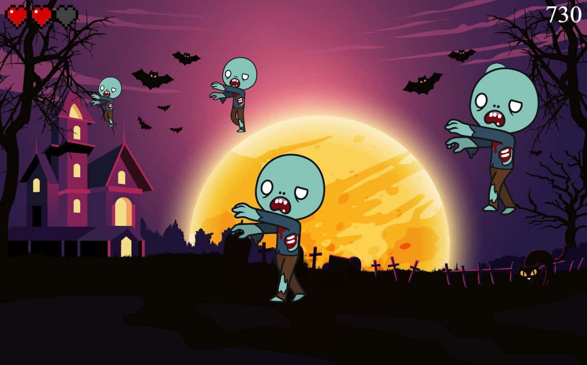

This is a simple zombie shooter game created as an assignment for web applications course at AGH UST.

Game rules:

1. Zombies spawn at random y-position with random speed and random size.
2. You get 20 points for hitting a zombie and -5 points for missing.
3. Every time a zombie reaches left edge of the board, you lose one heart.

